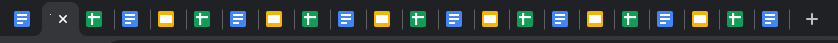
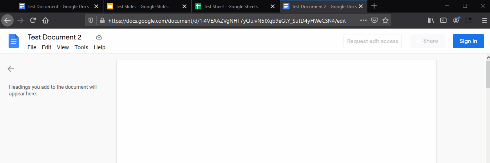
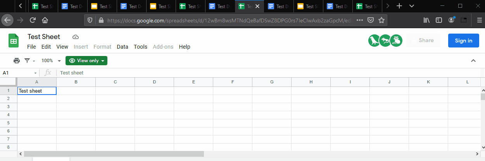

# no-tab-left-behind

Do your browser tabs look like this? 

**No Tab Left Behind can save you!**

# Get it from Extension stores

* [Firefox](https://addons.mozilla.org/en-US/firefox/addon/no-tab-left-behind/)
* [Chrome](https://chrome.google.com/webstore/detail/no-tab-left-behind/nohaefmmbjjgbjklonigabcnpooifgdn)
* [Edge](https://microsoftedge.microsoft.com/addons/detail/no-tab-left-behind/adjglholkoebndnfihlofjlileneilen)

# The Problem

Have your browser tabs gotten so small that you can't even fit an icon? Fear no more, No Tab Left Behind is here to solve your problems!

## Stops new, wasteful tabs!
No Tab Left Behind watches when you open a Google Drive file, and if you already have it open, it prevents the new duplicate window. Instead, NTLB draws your focus to your existing tab!  Even if its another window!

## Cleans up your existing tabs!

Already have so many tabs you can't even tell what you have open?  No problem!

When you first install No Tab Left Behind, we'll even offer to vacuum up your existing duplicate tabs!

